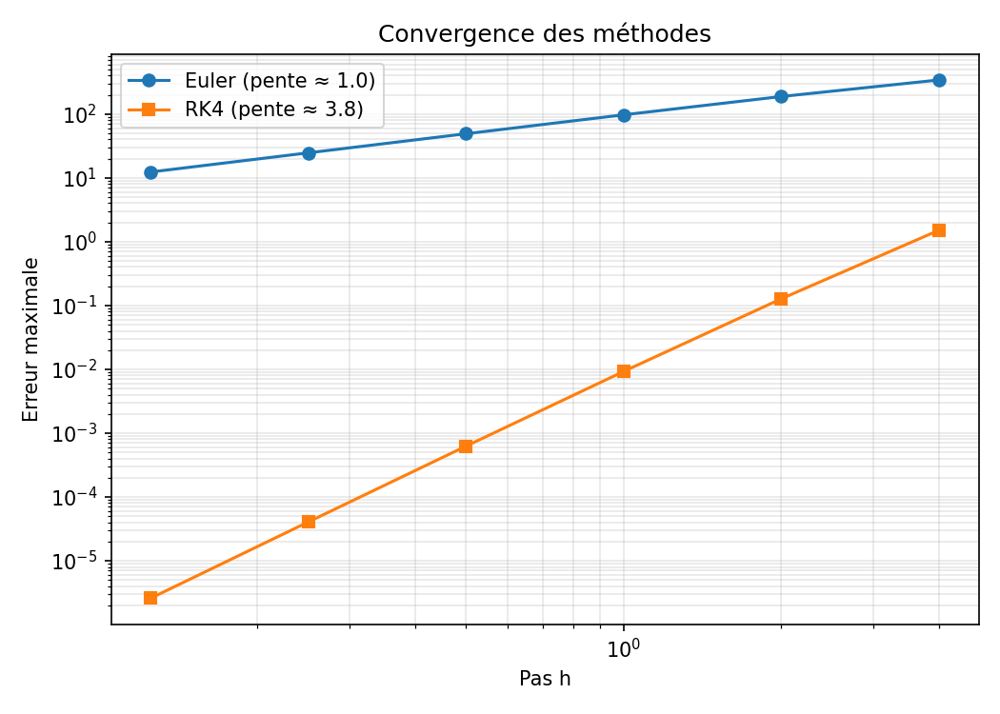

# Modèles épidémiques SIR et SEIR : méthodes numériques

Simulation numérique des modèles SIR (Susceptibles, Infectés, Guéris) et SEIR
(avec période d'incubation), comparaison de méthodes de résolution d'EDO
(Euler, Runge-Kutta 4) et étude de l'effet des paramètres. Projet réalisé dans
le cadre de la Licence Modélisation Mathématique, Analyse et Simulation
Numériques (UNCHK).

## Les modèles

Population totale constante N.

**SIR**

    dS/dt = -β·S·I/N
    dI/dt =  β·S·I/N - γ·I
    dR/dt =  γ·I

**SEIR** (E : exposés, infectés mais pas encore contagieux)

    dS/dt = -β·S·I/N
    dE/dt =  β·S·I/N - σ·E
    dI/dt =  σ·E - γ·I
    dR/dt =  γ·I

- β : taux de transmission
- γ : taux de guérison (1/γ = durée de la maladie)
- σ : taux d'incubation (1/σ = durée d'incubation)
- R0 = β/γ : nombre de reproduction de base (l'épidémie croît si R0 > 1)

## Méthodes

- **Euler explicite** (ordre 1)
- **Runge-Kutta 4** (ordre 4)
- **Référence** : `scipy.integrate.solve_ivp` (DOP853, tolérance 1e-12), car le
  système SIR n'a pas de solution exacte simple.

## Structure du projet

    src/sir.py           modèle SIR, Euler, RK4, solution de référence
    src/seir.py          modèle SEIR
    src/main.py          trajectoires SIR et étude de convergence
    src/analyse_seir.py  comparaison SIR/SEIR, effet de σ, pic en fonction de R0
    results/             figures générées

## Installation et lancement

    pip install -r requirements.txt
    python src/main.py
    python src/analyse_seir.py

Les scripts se lancent depuis la racine du projet (les figures sont écrites dans
`results/`).

## Résultats

### 1. Trajectoires SIR (N = 1000, β = 0.3, γ = 0.1, R0 = 3)

### 2. Convergence des méthodes

Ordres observés : ≈ 0.96 pour Euler et ≈ 3.84 pour RK4, cohérents avec la
théorie (1 et 4).

### 3. SIR contre SEIR (mêmes β et γ, incubation moyenne de 5 jours)

L'incubation retarde et aplatit l'épidémie : le pic passe de 301 infectés (jour
38) à 197 infectés (jour 78). Attention : la simulation SIR démarre avec
1 infecté, la simulation SEIR avec 1 exposé ; une partie du retard vient de
cette différence de condition initiale.

### 4. Effet de la durée d'incubation

| σ | Incubation | Pic (infectés) | Jour du pic |
|---|-----------|----------------|-------------|
| 0.1 | 10 j | 147 | 107 |
| 0.2 | 5 j | 197 | 78 |
| 0.5 | 2 j | 249 | 57 |
| 2.0 | 0.5 j | 286 | 44 |

Plus l'incubation est longue, plus le pic est bas et tardif ; quand elle tend
vers 0, on retrouve le SIR.

### 5. Pic épidémique en fonction de R0 (SIR)

Le pic simulé est comparé à la formule issue de l'intégrale première du SIR
(écart maximal de 0.01 individu sur N = 1000).

### Vérification

La population totale reste constante dans la simulation SEIR (écart maximal de
l'ordre de 1e-12).

## Limites

- Population homogène et constante, sans naissances, décès ni vaccination.
- Immunité permanente après guérison.
- Paramètres fictifs, sans calage sur des données réelles.

## Pistes d'amélioration

- Estimer β, γ et σ à partir de données réelles (moindres carrés).
- Ajouter la vaccination, la démographie ou la perte d'immunité (SEIRS).
- Version stochastique du modèle.

## Références

- Kermack & McKendrick (1927), modèle SIR.
- Cours d'analyse numérique, UNCHK.

## Licence

MIT
